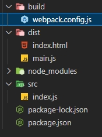

# webpack5学习

## 起步

###  [什么是webpack](https://juejin.cn/post/6844903588607557639)

> 可以看做一个模块化打包机，分析项目结构，处理模块化依赖，转换成为浏览器可运行的代码。
>
> - 代码转换: TypeScript 编译成 JavaScript、SCSS,LESS 编译成 CSS.
> - 文件优化：压缩 JavaScript、CSS、HTML 代码，压缩合并图片。
> - 代码分割：提取多个页面的公共代码、提取首屏不需要执行部分的代码让其异步加载。
> - 模块合并：在采用模块化的项目里会有很多个模块和文件，需要构建功能把模块分类合并成一个文件。
> - 自动刷新：监听本地源代码的变化，自动重新构建、刷新浏览器。
>
> 构建把一系列前端代码自动化去处理复杂的流程，解放生产力。

### 初始化项目

src/index.js

```javascript
function component() {
  const element = document.createElement("div");
  element.innerHTML = _.join(['hello','webpack'],' ');
  return element;
}
document.body.appendChild(component());
```

index.html

```html
<!DOCTYPE html>
<html>
  <head>
    <meta charset="utf-8" />
    <title>起步</title>
    <script src="https://unpkg.com/lodash@4.17.20"></script>
  </head>
  <body>
    <script src="./src/index.js"></script>
  </body>
</html>
```

目录结构：


上面的index.html在网页直接打开可以查看，但是lodash库是在html中引入的，这种管理方式有一些问题：

- 无法直接体现，脚本的执行依赖于外部库。
- 如果依赖不存在，或者引入顺序错误，应用程序将无法正常运行。
- 如果依赖被引入但是并没有使用，浏览器将被迫下载无用代码。

### 使用webpack管理

安装webpack、webpack-cli

```bash
mkdir webpack-demo
cd webpack-demo
npm init -y
npm install webpack webpack-cli --save-dev
```

安装lodash依赖：`npm install --save lodash`

index.html中lodash<script>删除

```html
<!DOCTYPE html>
<html>
  <head>
    <meta charset="utf-8" />
    <title>起步</title>
  </head>
  <body>
    <script src="./src/index.js"></script>
  </body>
</html>
```

src/index.js中引入lodash

```javascript
import _ from "lodash";
function component() {
  const element = document.createElement("div");
  element.innerHTML = _.join(['hello','webpack'],' ');
  return element;
}
document.body.appendChild(component());
```

此时在浏览器中打开index.html会报错，因为无法执行引入的lodash库，因此需要使用webpack“转译”代码，以便能在浏览器中执行。

package.json添加scripts：`"build": "webpack"`

```json
{
  "name": "webpack-demo",
  "version": "1.0.0",
  "description": "",
  "scripts": {
    "build": "webpack",
  },
  "keywords": [],
  "author": "",
  "license": "ISC",
  "devDependencies": {
    "webpack": "^5.75.0",
    "webpack-cli": "^5.0.0",
  }
}

```

创建dist目录，将index.html放入，修改引入<script>的`./src/index.js`为`main.js`

终端运行`npm run build`打包，在dist中会生成main.js


index.html打开可显示正常

### 使用配置文件

根目录下新建build/webpack.config.js

```javascript
const path = require('path');
module.exports = {
  entry: './src/index.js',
  output: {
    filename: 'main.js',
    path: path.resolve(__dirname, '../dist'),
  },
};
```

更改package.json的scripts，使用此配置文件：

```json
{
  "name": "webpack-demo",
  "version": "1.0.0",
  "description": "",
  "scripts": {
    "build": "webpack --config ./build/webpack.config.js"
  },
  "keywords": [],
  "author": "",
  "license": "ISC",
  "devDependencies": {
    "webpack": "^5.75.0",
    "webpack-cli": "^5.0.0"
  },
  "dependencies": {
    "lodash": "^4.17.21"
  }
}
```

项目目录：



打包命令：`npm run build`

注意：package.json中如果有`type:module|commonjs`会报错，删除即可，因为在 package.json 中设置 `"type": "module"` 会强制 package.json 下的所有文件使用 ECMAScript 模块。 设置 `"type": "commonjs"` 将会强制使用 CommonJS 模块。


## 管理资源

### 加载CSS

为了让JavaScript模块中能引入css文件，需要安装css-loader和style-loader并配置webpack

```bash
npm install --save-dev style-loader css-loader
```

build/webpack.config.js

```javascript
module.exports = {
  entry: './src/index.js',
  output: {
    filename: 'main.js',
    path: path.resolve(__dirname, '../dist'),
  },
  module: {
    rules: [
      {
        test: /\.css$/i,
        use: ['style-loader','css-loader']
      }
    ]
  }
}
```

loader执行顺序从下至上，从右至左。即先执行css-loader，再执行style-loader，[loader概念](https://webpack.docschina.org/concepts/loaders/)

添加文件src/style.css

```css
body {
  color:red;
}
```

src/index.js中引入

```JavaScript
import _ from "lodash";
import "./style.css";
function component() {
  // ...省略
}
document.body.appendChild(component());
```

运行build命令：`npm run build`，在浏览器中打开dist/index.html，可以看到style.css的内容以<style>标签添加至html的<head>中。


### 加载图像

为了引入图像，以使用内置的 [Asset Modules](https://webpack.docschina.org/guides/asset-modules/)，webpack配置如下：

```JavaScript
module.exports = {
   //...省略
  module: {
    rules: [
      //...省略
      {
        test: /\.(png|jpg|jpeg|svg|gif)$/i,
        type: 'asset/resource',
        //生成的输出文件配置
        generator: {
          filename: 'static/[hash][ext][query]',
        },
      }
    ]
  }
};
```

src/index.js引入图片

```javascript
import _ from "lodash";
import "./style.css";
import MyImage from "./background.jpg";
function component() {
  const element = document.createElement("div");
  element.innerHTML = _.join(['hello','webpack'],' ');
  const image = new Image();
  image.src = MyImage;
  element.appendChild(image);
  return element;
}

document.body.appendChild(component());
```

再次打包编译`npm run build`即可看到图片被插入到页面中

### 加载字体

build/webpack.config.js

```JavaScript
module.exports = {
   //...省略
  module: {
    rules: [
      //...省略
      {
        test: /\.(woff|woff2|eot|ttf|otf)$/i,
        type: 'asset/resource',
      }
    ]
  }
};
```

src/style.css

```css
@font-face {
  font-family: 'MyFont';
  src: url('./IndieFlower.ttf') format('ttf');
  font-weight: 600;
  font-style: normal;
}
body {
  color: red;
  font-family: MyFont;
}
img {
  width: 100px;
}
```

再次打包编译`npm run build`即可看到页面字体发生变化

其他资源模块加载参考[资源模块](https://webpack.docschina.org/guides/asset-modules/)、[加载数据](https://webpack.docschina.org/guides/asset-management/#loading-data)

### 加载JS

使用babel-loader，转移JavaScript文件，安装：`npm install --save-dev babel-loader @babel/core @babel/preset-env`

配置build/webpack.config.js：

```javascript
module.exports ={
    module: {
      rules: [
        {
          test: /\.m?js$/,
          exclude: /node_modules/,
          use: {
            loader: 'babel-loader',
            options: {
              presets: ['@babel/preset-env']
            }
          }
        }
      ]
}
}
```

### 加载Vue

1. **Vue2**

   安装vue2、vue-loader、vue-template-compiler：

   ```bash
   npm install --save-dev vue-loader@15 vue-template-compiler
   npm install --save vue@2
   ```

   下载的版本：vue^2.7.14， vue-loader^15.10.1， vue-template-compiler^2.7.14，

   修改build/webpack.config.js配置

   ```javascript
   const HtmlWebpackPlugin = require('html-webpack-plugin');
   const { VueLoaderPlugin } = require('vue-loader');
   module.exports={
     entry: {
       // index: './src/index.js',
       // Vue 入口
       main: './src/main.js',
     },
     //...
     modules: {
       rules: [
         //...
         {
           test: /\.vue$/,
           loader: 'vue-loader',
         },
       ]
     },
     plugins: [
       new HtmlWebpackPlugin({
         title: 'webpack demo',
         filename: 'index.html',
         template: './index.html', //默认根目录是项目根目录，而不是当前文件的目录
       }),
       new VueLoaderPlugin(),
     ],
   }
   ```

   src/main.js

   ```javascript
   import Vue from 'vue';
   import App from './App.vue';
   new Vue({ render: (h) => h(App) }).$mount('#app');
   ```

   App.vue

   ```vue
   <template>
     <div id="app">
       <div class="title">{{msg}}</div>
     </div>
   </template>
   
   <script>
   export default {
     name: 'app',
     data() {
       return {
         msg: 'Hello world',
       };
     },
   }
   </script>
   
   <style>
   #app {
     text-align: center;
     color: #2c3e50;
     margin-top: 60px;
   }
   .title {
     color: red;
   }
   </style>
   ```

   报错解决：

   1. Module build failed (from ./node_modules/vue-loader/dist/index.js): TypeError: Cannot read properties of undefined (reading 'styles')

      vue-loader版本和vue2.7不兼容，需要下载vue-loader@15

   2. TypeError: VueLoaderPlugin is not a constructor

      webpack配置引入VueLoaderPlugin改为：

      ```JavaScript
      const { VueLoaderPlugin } = require('vue-loader');
      ```

      旧的版本是：

      ```JavaScript
      const VueLoaderPlugin = require('vue-loader/lib/plugin')
      ```

   3. 使用mini-css-extract-plugin报错：

      ```bash
      ERROR in ./src/App.vue?vue&type=style&index=0&id=0153ebf0&prod&lang=css& 
      (...) 1:0
      Module parse failed: Unexpected token (1:0)
      File was processed with these loaders:
       * ./node_modules/sass-loader/dist/cjs.js
       * ./node_modules/vue-loader/lib/index.js
      You may need an additional loader to handle the result of these loaders. 
      > #app{text-align:center;color:#2c3e50;margin-top:60px}.title{color:red}
      ```

      css-loader4.x以上默认esModule为true，因此修改此配置为false即可：build/webpack.config.js

      ```javascript
      module.exports={
        module: {
            //...
            rules: [
              {
                test: /\.css$/i,
                use: [
                  { loader: 'style-loader', options: { esModule: false } },
                  { loader: 'css-loader', options: { esModule: false } },
                ],
              },
              //...
            ]
        }
      }
      ```

   4. 修改版本：

      ```json
      "css-loader": "^5.0.1",
      "style-loader": "^2.0.0",
      "mini-css-extract-plugin": "^1.3.3",
      ```

   4. vue文件中定义的样式未生效

2. **Vue3**

### 加载TypeScript

`npm install --save-dev typescript ts-loader`

修改目录结构，添加src/index.ts和tsconfog.json：


src/index.ts

```javascript
import * as _ from 'lodash';
function component() {
  const element = document.createElement('div');
  element.innerHTML = _.join(['hello', 'webpack'], ' ');
  return element;
}
document.body.appendChild(component());
```

注：如果该文件报错*...“lodash.js” is not a module ts(2306)*，安装@types/lodash即可。`npm install --save-dev @types/lodash`

tsconfig.json

```json
{
  "compilerOptions": {
    "outDir": "./dist/",
    "noImplicitAny": true,
    "module": "es6",
    "target": "es5",
    "jsx": "react",
    "allowJs": true,
    "moduleResolution": "node"
  }
}
```

查看 [TypeScript 官方文档](https://www.typescriptlang.org/docs/handbook/tsconfig-json.html) 了解更多关于 `tsconfig.json` 的配置选项。

想要了解 webpack 配置的更多信息，请查看 [配置](https://webpack.docschina.org/concepts/configuration/) 概念。

build/webpack.config.js配置

```javascript
const path = require('path');

module.exports = {
  entry: '../src/index.ts',
  module: {
    rules: [
      {
        test: /\.tsx?$/,
        use: 'ts-loader',
        exclude: /node_modules/,
      },
    ],
  },
  resolve: {
    //指定extension之后可以不用在require或是import的时候加文件扩展名,会依次尝试添加扩展名进行匹配
    extensions: ['.tsx', '.ts', '.js'],
  },
  output: {
    filename: 'main.js',
    path: path.resolve(__dirname, '../dist'),
  },
};
```

**loader**：如果已使用babel-loader，可以使用@babel/preset-typescript

**source maps**：配置tsconfig.json的属性compilerOptions.sourceMap:true

**Client types**：你可以在 TypeScript 代码中使用 webpack 特定的特性，比如 [`import.meta.webpack`](https://webpack.docschina.org/api/module-variables/#importmetawebpack)。并且 webpack 也会为它们提供类型支持，只需要添加一个 TypeScript [`reference`](https://www.typescriptlang.org/docs/handbook/triple-slash-directives.html#-reference-types-) 声明：

```ts
/// <reference types="webpack/module" />
console.log(import.meta.webpack); // 没有上面的声明的话，TypeScript 会抛出一个错误
```

**使用第三方库**：使用第三方库时需要安装此库的类型声明文件。如使用lodash库则需要安装@types/lodash

**导入其他资源**：想要在ts中使用其他非代码资源(如图片、字体等)，需要告诉typescript推断导入资源的类型。

如在src/index.ts中导入jpg图片，则需要在项目中创建一个声明文件如custom.d.ts，为.jpg设置声明：

```typescript
declare module '*.jpg' {
  const content: any;
  export default content;
}
```

## 管理输出

在src中添加print.js文件

```JavaScript
export default function printMe() {
  console.log("I get called from print.js");
}
```

src/index.js修改为：

```JavaScript
import _ from "lodash";
import "./style.css";
import MyImage from "./background.jpg";
import printMe from "./print.js";
function component() {
  const element = document.createElement("div");
  element.innerHTML = _.join(['hello','webpack'],' ');
  const image = new Image();
  image.src = MyImage;
  element.appendChild(image);
  const btn = document.createElement('button');
  btn.innerHTML = 'Click me and check the console!';
  btn.onclick = printMe;
  element.appendChild(btn);
  return element;
}

document.body.appendChild(component());
```

如果输出文件名频繁修改，或者entry中文件不止一个的情况，上面的管理方式每次打包完都需要更新dist/index.html，不利于管理。webpack提供插件支持使这个过程更易管控。

### HtmlWebpackPlugin

安装插件：`npm install --save-dev html-webpack-plugin`，修改build/webpack.config.js

```javascript
const path = require('path');
const HtmlWebpackPlugin = require("html-webpack-plugin");
module.exports = {
  entry: {
    index: './src/index.js',
    print: './src/print.js',
  },
  output: {
    filename: '[name].bundle.js',
    path: path.resolve(__dirname, '../dist'),
  },
  //...省略
  plugins: [new HtmlWebpackPlugin({ title: '管理输出' })],
};

```

`npm run build`构建后可以看到dist中由插件生成的index.html

```html
<!DOCTYPE html>
<html>
  <head>
    <meta charset="utf-8">
    <title>管理输出</title>
    <meta name="viewport" content="width=device-width, initial-scale=1">
    <script defer src="index.bundle.js"></script>
    <script defer src="print.bundle.js"></script>
  </head>
  <body>
  </body>
</html>
```

### 清理dist

在每次构建前清理dist文件夹，否则之前生成的文件都会在文件夹中，显得相当杂乱。修改webpack配置：

```javascript
//...省略
module.exports = {
  //...省略
  output: {
    filename: '[name].bundle.js',
    path: path.resolve(__dirname, '../dist'),
    clean: true
  },
  //...省略
};
```

`npm run build`构建后可以看到dist中之前遗留的文件都被清理掉了，只有这次构建的结果。

### publicPath

用于指定应用程序中所有资源的基础路径。发送到 `output.path` 目录的每个文件，都将从 `output.publicPath` 位置引用。

```JavaScript
//...省略
module.exports = {
  //...省略
  output: {
    filename: '[name].bundle.js',
    path: path.resolve(__dirname, '../dist'),
    clean: true,
    publicPath: '../dist',
  },
  //...省略
};
```

### bundle输出分析

- [webpack-chart](https://alexkuz.github.io/webpack-chart/): webpack stats 可交互饼图。

- [webpack-visualizer](https://chrisbateman.github.io/webpack-visualizer/): 可视化并分析你的 bundle，检查哪些模块占用空间，哪些可能是重复使用的。

- [webpack-bundle-analyzer](https://github.com/webpack-contrib/webpack-bundle-analyzer)：一个 plugin 和 CLI 工具，它将 bundle 内容展示为一个便捷的、交互式、可缩放的树状图形式。

  `npm install --save-dev webpack-bundle-analyzer`，配置webpack.config.js：

  ```javascript
  const WebpackBundleAnalyzer = require('webpack-bundle-analyzer').BundleAnalyzerPlugin;
  module.exports={
      //...
      plugins: [
        //...
        new WebpackBundleAnalyzer({
          analyzerPort: 9999  //bundle analyzer的端口，默认8888
        }),
      ],
  }
  ```

- [webpack bundle optimize helper](https://webpack.jakoblind.no/optimize)：这个工具会分析你的 bundle，并提供可操作的改进措施，以减少 bundle 的大小。

- [bundle-stats](https://github.com/bundle-stats/bundle-stats)：生成一个 bundle 报告（bundle 大小、资源、模块），并比较不同构建之间的结果。

### [manifest](https://webpack.docschina.org/concepts/manifest)

待学习。。。


## 代码分离

> 主要有 2 种方式：
>
> - [分离业务代码和第三方库](https://link.zhihu.com/?target=https%3A//webpack.js.org/guides/code-splitting/%23resource-splitting-for-caching-and-parallel-loads)（ vendor ）
> - [按需加载](https://link.zhihu.com/?target=https%3A//webpack.js.org/guides/code-splitting/%23resource-splitting-for-caching-and-parallel-loads)（利用 [import()](https://link.zhihu.com/?target=https%3A//github.com/tc39/proposal-dynamic-import) 语法动态导入）
>
> 之所以把业务代码和第三方库代码分离出来，是因为产品经理的需求是源源不断的，因此业务代码更新频率大，相反第三方库代码更新迭代相对较慢且可以锁版本，所以可以充分利用浏览器的缓存来加载这些第三方库。
>
> 而按需加载的适用场景，比如说「访问某个路由的时候再去加载对应的组件」，用户不一定会访问所有的路由，所以没必要把所有路由对应的组件都先在开始的加载完；更典型的例子是「某些用户他们的权限只能访问某些页面」，所以没必要把他们没权限访问的页面的代码也加载。
>
> 参考：[Webpack 大法之 Code Splitting](https://zhuanlan.zhihu.com/p/26710831)

将代码分离到不同的bundle中，然后可以按需加载或并行加载这些文件。

### 问题引入

添加src/another-module.js如下

```javascript
import _ from "lodash";
console.log(_.join(["another","module","loaded!"]," "));
```

build/webpack.config.js修改entry：

```JavaScript
module.exports = {
  entry: {
    index: './src/index.js',
    another: './src/another-bundle.js',
    print: './src/print.js',
  },
  output: {
    filename: '[name].bundle.js',
    path: path.resolve(__dirname, '../dist'),
    clean: true,
  },
  // ...省略
}
```

构建结果：


bundle-analyzer分析结果：


可以看到another-bundle.js和index.js都引入了lodash，按之前的配置构建后的两个bundle重复引入了lodash。

### 防止重复

1. **入口依赖**（不建议使用）

   配置dependOn选项，在多个chunk中共享模块：

   ```JavaScript
   module.exports = {
     mode: 'development',
     entry: {
       index: {
           import: './src/index.js',
           dependOn: 'shared',
       },
       another: {
           import: './src/another-bundle.js',
           depemdOn: 'shared'
       },
       print: './src/print.js',
       shared: 'lodash',
     },
     output: {
       filename: '[name].bundle.js',
       path: path.resolve(__dirname, '../dist'),
       clean: true,
     },
     // ...省略
   }
   ```

   如图，index.bundle.js和another.bundle.js的公共资源被打包到shared.bundle.js中。

   这种方法配置虽然可行，但是每次有新的重复引入的模块都需要修改配置，确定每个入口文件是否有公共模块并提取出来，比较麻烦。

2. **使用插件SplitChunksPlugin**

   该插件可以将公共的依赖模块提取到已有入口chunk中或提取到一个新的chunk。配置optimization.splitcChunks，如下：
   可参考：https://juejin.cn/post/7101555050194927624
   ```javascript
   module.exports = {
     mode: 'development',
     entry: {
       index: './src/index.js',
       another: './src/another-bundle.js',
     },

     optimization: {
       runtimeChunk: 'single',
       splitChunks: {
         chunks: 'async', //创建一个vendors chunk,包括整个应用程序中的node_modules的所有代码，引用次数>-2次就会被打包到同一个vendor中，否则会分开
         cacheGroups: {
          // 如果你的项目中包含 element-ui 等第三方组件（组件较大），建议单独拆包
          elementUI: {
            name: "chunk-elementUI", // 单独将 elementUI 拆包
            priority: 15, // 权重需大于其它缓存组
            test: /[\/]node_modules[\/]element-ui[\/]/
          }
         }
       }
     },
   }
   ```

   构建结果如下，可以看到和上一个方法效果差不多：

   

   bundle-analyzer分析结果：

   

   splitChunks默认配置：

   ```JavaScript
   module.exports = {
     //...
     optimization: {
       splitChunks: {
         chunks: 'async', 
         minSize: 20000, // 生成 chunk 的最小体积
         minRemainingSize: 0,
         minChunks: 1,
         maxAsyncRequests: 30,
         maxInitialRequests: 30,
         enforceSizeThreshold: 50000,
         cacheGroups: {
           // node_modules中的引用模块都会被打包到一个默认的vendors bundle
           defaultVendors: {
             test: /[\\/]node_modules[\\/]/,
             priority: -10,
             reuseExistingChunk: true,
           },
           // 被引用大于2次的模块都会被打包到commons bundle
           default: {
             minChunks: 2,
             priority: -20,
             reuseExistingChunk: true,
           },
         },
       },
     },
   };
   ```

### 动态导入

当涉及动态代码拆分时，可以使用import()语法动态导入，或webpack的遗留功能require.ensure

例如将src/index.js改为动态导入lodash

```JavaScript
function component() {
  return import('lodash').then(({ default: _ }) => {
    const element = document.createElement('div');
    element.innerHTML = _.join(['hello', 'webpack'], ' ');
    return element;
  });
}
component().then((comp)=>document.body.appendChild(comp));
```

此时lodash引入的库会在自动分离到单独的bundle中：


### 懒加载

上面的动态导入在加载页面的lodash就会请求它，实际上并不会让性能更好

应该在模块被使用的时候再请求该模块。以print.js模块为例，修改src/index.js的btn.onclick事件，在点击的时候再加载该模块：

```JavaScript
function component(){
//...
  btn.onclick = () =>
    import(/* webpackChunkName: "print" */ './print.js').then((module) => {
      print = module.default;
      print();
    });
}
document.body.appendChild(component());
```

`npm run build `后浏览器打开dist/index.html，可以看到页面加载时并没有请求print.js


点击button后才会请求：


**框架懒加载**

- React: [Code Splitting and Lazy Loading](https://reactjs.org/docs/code-splitting.html)
- Vue: [Dynamic Imports in Vue.js for better performance](https://vuedose.tips/tips/dynamic-imports-in-vue-js-for-better-performance/)
- Angular: [Lazy Loading route configuration](https://angular.io/guide/router#milestone-6-asynchronous-routing) and [AngularJS + webpack = lazyLoad](https://medium.com/@var_bin/angularjs-webpack-lazyload-bb7977f390dd)

### preload/prefetch

- prefetch(预获取)：其他导航中可能用到的资源；在父 chunk 加载**结束后**开始加载
- preload(预加载)：当前导航中可能用到的资源；在父 chunk 加载时，以**并行**方式开始加载

导入时添加`/* webpackPrefetch: true */ `或`/* webpackPreload: true */ `即可。如：

```JavaScript
import(/* webpackPrefetch: true */ './path/to/LoginModal.js');
```

这会生成 `<link rel="prefetch" href="login-modal-chunk.js">` 并追加到页面头部，指示着浏览器在闲置时间预取 `login-modal-chunk.js` 文件。


## 缓存配置

通过浏览器访问部署在服务器上的dist目录中的资源时，由于获取资源比较耗时，因此浏览器会使用缓存以降低网络流量，使网站二次加载时更快。但如果部署新版本时不更改资源名，则浏览器会使用缓存版本，不会获取新的文件。因此需要确保文件内容变化后，webpack编译生成的文件名也有变化，以获取新的资源。

### 输出文件的文件名

替换output.filename定义输出文件的名称。

```javascript
module.exports = {
    //...省略
    output: {
        filename: '[name].[contenthash].js',
        path: path.resolve(__dirname, '../dist'),
        clean: true,
    },
}
```

如下图可看到输出文件的名称都是文件内容的hash映射。如果文件未修改，再次构建文件名会保持不变（实际情况不一定...）

### 模块标识符

当文件解析顺序发生变化时，module.id也会变，因此文件内容未改变的文件构建结果的hash可能也会发生变化。

解决方法：配置`optimization.moduleIds:'deterministic'`

### 提取引导模块

将runtime代码拆分为单独的chunk：设置`optimization.runtimeChunk:'single'`，前面已设置过。


## 环境变量 env

使用webpack命令行环境配置参数--env可传入任意环境变量：

package.json中修改scripts.build：

```javascript
"scripts": {
    "build": "webpack --env goal=local --env production --config ./build/webpack.config.js",
  },
```

若要在webpack配置中使用env变量，则需修改webpack.config.js的module.exports为一个函数：

```JavaScript
const path = require('path');
module.exports = (env) => {
  console.log('goal', env.goal);
  console.log('production', env.production);
  return {
    mode: 'development',
    entry: {
      index: './src/index.js',
    },
    //...省略
  };
};

```

`npm run build`输出结果：


## 开发环境

开发环境中，需要source map、一个有live reloading(实时重加载)或hot replacement(热模块替换)能力的localhost server。

通常在配置中添加`mode: 'development'`设置为开发环境

### source map

当webpack打包源码时，可能难以追踪error在源码中的位置。例如，修改src/print.js，生成一个错误：

```JavaScript
export default function printMe() {
  cosole.log("I get called from print.js");   //cosole名称错误
}
```

如图错误位置不明确


为了更容易追踪error和warning，JavaScript提供了source maps功能，可将编译后的代码映射回源码。

使用source-map`devtool: 'inline-source-map'`，如图可对应到源码print.js文件的第2行


source map相当耗资源，不建议在生产环境使用。

### watch模式

package.json中添加scripts：`"watch": "webpack --watch --config ./build/webpack.config.js"`，执行`npm run watch`可以看到webpack自动重新编译修改后的模块，但浏览器中仍需要刷新。

### webpack-dev-server

每次编译代码都需要手动`npm run build`会很麻烦，webpack-dev-server插件可以在每次文件变化时自动构建更新。

安装：`npm install --save-dev webpack-dev-server`，配置：

```javascript
//...省略
module.exports = {
  //...省略
  mode: 'development',
  devtool: 'inline-source-map',
  devServer: {
    static: './dist',
    open: true
  },
  optimization: {
    runtimeChunk: 'single'
  },
 //...省略
};

```

package.json中新增`"start": "webpack serve --config ./build/webpack.config.js"`；运行`npm start`

### 热模块更新

可以在运行时更新所有类型的模块，而无需完全刷新。配置build/webpack.config.js的devServer.hot选项即可开启：

```javascript
//...
module.exports = {
    //...
    devServer: {
      static: './dist',
      open: true,
      hot: true,
    },
	//...
};

```

## 生产环境

生产环境关注压缩bundle、更轻量的source map、资源优化等，以改善加载时间。通常不同环境编写独立的webpack配置。

通常在配置中添加`mode: 'production'`设置为生产环境

### 配置

开发环境和生产环境大部分配置相同，为遵循DRY原则，保留一个common配置，使用webpack-merge合并配置。

安装配置合并工具：`npm install --save-dev webpack-merge`

在build文件夹中新建webpack.commom.js、webpack.dev.js、webpack.prod.js


build/webpack.common.js

```javascript
const path = require("path");
const HtmlWebpackPlugin = require("html-webpack-plugin");
module.exports = {
  entry: {
    index: './src/index.js',
  },
  output: {
    filename: '[name].bundle.js',
    path: path.resolve(__dirname, '../dist'),
    clean: true,
  },
  //...
  plugins: [
    new HtmlWebpackPlugin({
      title:'production',
    })
  ]
}
```

build/webpack.dev.js

```javascript
const {merge} = require('webpack-merge');
const common = require("./webpack.common.js");
module.exports = merge(common, {
  mode: 'development',
  devtool: 'inline-source-map',
  devServer: {
    static: '../dist',
    hot: true,
    open: true,
  }
})
```

build/webpack.prod.js

```javascript
const { merge } = require("webpack-merge");
const common = require("./webpack.common.js");

module.exports = merge(common,{
  mode: 'production',
})
```

package.json

```json
{
  "name": "webpack-demo",
  "scripts": {
     "build": "webpack --env goal=local --env production --config ./build/webpack.prod.js",
     "start": "webpack serve --config ./build/webpack.dev.js"
  },
  //...
}
```

### 指定NODE_ENV

使用DefinePlugin设置process.env.NODE_ENV的值，如下为build/webpack.prod.js

```javascript
const { merge } = require('webpack-merge');
const common = require('./webpack.common.js');
const webpack = require('webpack');

module.exports = merge(common, {
  mode: 'development',
  devtool: 'inline-source-map',
  devServer: {
    static: '../dist',
    hot: true,
    open: true,
  },
  plugins: [
    new webpack.DefinePlugin({
      'process.env': { NODE_ENV: '"development"' }, //注意：值带引号"development"
    }),
  ],
});
console.log(process.env.NODE_ENV); //"development"
```

### 压缩HTML
配置html-webpack-plugin的minify选项
```javascript
module.exports={
  //...
  plugins: [
    new HtmlWebpackPlugin({
      template: path.resolve(__dirname,'./index.html'), 
      filename: '../index.html',
      minify: {
        removeComments: true,
        removeRedundantAttributes: true,
        removeScriptTypeAttributes: true,
        removeStyleLinkTypeAttributes: true,
        collapseWhitespace: true,
        useShortDoctype: true,
      },
      chunksSortMode: 'dependency'
    })
  ]
}
```

### 压缩CSS

> 本插件会将 CSS 提取到单独的文件中，为每个包含 CSS 的 JS 文件创建一个 CSS 文件，并且支持 CSS 和 SourceMaps 的按需加载。
>
> 参考[mini-css-extract-plugin](https://webpack.docschina.org/plugins/mini-css-extract-plugin/#minimizing-for-production)

安装`mini-css-extract-plugin`分离css：`npm install --save-dev mini-css-extract-plugin`

安装`css-minimizer-webpack-plugin`压缩输出文件：`npm install --save-dev css-minimizer-webpack-plugin`

配置build/webpack.prod.js

```javascript
//...
const MiniCssExtractPlugin = require("mini-css-extract-plugin");
const CssMinimizerPlugin = require("css-minimizer-webpack-plugin");
module.exports = {
  //...
  optimization:{
    minimizer: [
      //...
      new CssMinimizerPlugin(),
    ],
  }
  plugins: [
    //...
    new MiniCssExtractPlugin({
      filename: 'css/[name].[contenthash].css',
      chunkFilename: 'css/[id].[contenthash].css',
      ignoreOrder: true,
    })
  ],
  module: {
    rules: [
      {
        test: /\.css$/i,
        use: [MiniCssExtractPlugin.loader, "css-loader"],
      },
    ],
  },
}
```

**示例**：新增src/style2.css，修改src/index.js引入style2.css

```javascript
// src/style2.css
.hello {
  background-color: black;
}

// src/index.js
import './style.css';
import './style2.css';
function component() {
  const element = document.createElement('div');
  element.classList.add('hello');
  element.innerHTML = join(['hello', 'webpack'], ' ');
  const btn = document.createElement('button');
  btn.innerHTML = 'Click me and check the console!';
  btn.onclick = printMe();
  element.appendChild(btn);
  return element;
}
document.body.appendChild(component());
```

`npm run build`构建后，可以看到打包后src/index.js里引入的两个css文件被合并在css/index.[hash].css里，且代码被压缩：


### 压缩JS

生产环境默认使用TerserWebpackPlugin，安装：`npm install terser-webpack-plugin --save-dev`，配置build/webpack.prod.js：

```javascript
//...
const TerserPlugin = require("terser-webpack-plugin");
module.exports = {
  optimization: {
     minimizer: [
      new TerserPlugin({
          test: /\.js(\?.*)?$/i, //匹配需要压缩的文件类型
          include: /\/src/,   //匹配参与压缩的文件
          parallel: true, // 多进程并发运行以提高构建速度，强烈建议添加此配置
          minify: TerserPlugin.uglifyJsMinify, // 类型为function，可自定义压缩函数，此处使用ugligy-js压缩
          extractComments: false, // 删除注释
          terserOptions: {
            format: {
              comments: false,
            },
          }
        })
      ],
   },
   //...
}
```

splitChunks

```javascript
module.exports = {
  optimization: {
    moduleIds: 'deterministic',
    minimize: true,
    runtimeChunk: 'single',
    splitChunks: {
      chunks: 'async', // 共有三个值可选：initial(初始模块)、async(按需加载模块)和all(全部模块)
      minSize: 30000, // 模块超过30k自动被抽离成公共模块
      minChunks: 1, // 模块被引用>=1次，便分割
      maxAsyncRequests: 5, // 异步加载chunk的并发请求数量<=5
      maxInitialRequests: 3, // 一个入口并发加载的chunk数量<=3
      name: true, // 默认由模块名+hash命名，名称相同时多个模块将合并为1个，可以设置为function
      automaticNameDelimiter: '~', // 命名分隔符
      cacheGroups: {
        // 缓存组，会继承和覆盖splitChunks的配置
        default: {
          // 模块缓存规则，设置为false，默认缓存组将禁用
          minChunks: 2, // 模块被引用>=2次，拆分至vendors公共模块
          priority: -20, // 优先级
          reuseExistingChunk: true, // 默认使用已有的模块
        },
        vendors: {
          test: /[\\/]node_modules[\\/]/, // 表示默认拆分node_modules中的模块
          priority: -10,
        },
      },
    },
    usedExports: true,
    minimizer: [
      new TerserPlugin({
        test: /\.js(\?.*)?$/i, //匹配需要压缩的文件类型
        include: /\/src/, //匹配参与压缩的文件
        parallel: true, // 多进程并发运行以提高构建速度，强烈建议添加此配置
        minify: TerserPlugin.uglifyJsMinify, // 类型为function，可自定义压缩函数，此处使用ugligy-js压缩
        extractComments: false, // 删除注释
        terserOptions: {
          compress: true,
          format: {
            comments: false,
          },
        },
      }),
      new CssMinimizerPlugin({
        test: /\.css$/,
        include: /\/src/,
        parallel: true,
      }),
    ],
  },
}
```
dllplugin
主要用于第三方库的缓存
无法按需加载
与splitChunks有冲突？
貌似没有配置的必要？
参考：https://juejin.cn/post/6844903996910469133

## 构建性能

### 通用环境

1. 优化loader配置

   将loader应用于最少数量的必要模块，使用include字段，仅将loader应用在实际需要将其转换的模块：

```JavaScript
const path = require('path');
module.exports = {
  //...
  module: {
    rules: [
      {
        test: /\.js$/,
        
        include: path.resolve(__dirname, 'src'),
        // exclude: /node_modules/,   //js库可能包含在内
        loader: 'babel-loader?cacheDirectory',//开启转换结果缓存
      },
    ],
  },
```

2. 引导(bootstrap)

   每个额外的 loader/plugin 都有其启动时间。尽量少地使用工具。

3. 解析

   以下步骤可以提高解析速度：
   - 减少 `resolve.modules`, `resolve.extensions`, `resolve.mainFiles`, `resolve.descriptionFiles` 中条目数量，因为他们会增加文件系统调用的次数。
   - 如果你不使用 symlinks（例如 `npm link` 或者 `yarn link`），可以设置 `resolve.symlinks: false`。
   - 如果你使用自定义 resolve plugin 规则，并且没有指定 context 上下文，可以设置 `resolve.cacheWithContext: false`。
   
   优化resolve.extensions配置
    在导入没带文件后缀的路径时，webpack会自动带上后缀去尝试询问文件是否存在，而resolve.extensions用于配置尝试后缀列表；默认为extensions:['js','json'];
    及当遇到require('./data')时webpack会先尝试寻找data.js，没有再去找data.json；如果列表越长，或者正确的后缀越往后，尝试的次数就会越多；
    所以在配置时为提升构建优化需遵守：
    - 频率出现高的文件后缀优先放在前面；
    - 列表尽可能的小；
    - 书写导入语句时，尽量写上后缀名
    因为项目中用的jsx较多，所以配置extensions: [".jsx",".js"],

    优化resolve.modules配置
    resolve.modules用于配置webpack去哪些目录下寻找第三方模块，默认是['node_modules']，但是，它会先去当前目录的./node_modules查找，没有的话再去../node_modules最后到根目录;
    所以当安装的第三方模块都放在项目根目录时，就没有必要安默认的一层一层的查找，直接指明存放的绝对位置
    ```javascript
    resolve: {
        modules: [path.resolve(__dirname, 'node_modules')],
    }
    ```

4. dll（仅供参考）
   原文：[性能优化篇---Webpack构建速度优化](https://segmentfault.com/a/1190000018493260)
   使用 `DllPlugin` 为更改不频繁的代码生成单独的编译结果。这可以提高应用程序的编译速度，尽管它增加了构建过程的复杂度。
   接入需要完成的事：
   - 将依赖的第三方模块抽离，打包到一个个单独的动态链接库中
   - 当需要导入的模块存在动态链接库中时，让其直接从链接库中获取
   - 项目依赖的所有动态链接库都需要被加载
   接入工具(webpack已内置)
   - DllPlugin插件：用于打包出一个个单独的动态链接库文件；
   - DllReferencePlugin:用于在主要的配置文件中引入DllPlugin插件打包好的动态链接库文件
   配置`webpack.dev.js`：
   ```javascript
    const path = require('path');
    const DllPlugin = require('webpack/lib/DllPlugin');

    module.exports = {
      mode: 'production',
      entry: {
          // 将React相关模块放入一个动态链接库
          react: ['react','react-dom','react-router-dom','react-loadable'],
          librarys: ['wangeditor'],
          utils: ['axios','js-cookie']
      },
      output: {
          filename: '[name]-dll.js',
          path: path.resolve(__dirname, 'dll'),
          // 存放动态链接库的全局变量名，加上_dll_防止全局变量冲突
          library: '_dll_[name]'
      },
      // 动态链接库的全局变量名称，需要可output.library中保持一致，也是输出的manifest.json文件中name的字段值
      // 如react.manifest.json字段中存在"name":"_dll_react"
      plugins: [
          new DllPlugin({
              name: '_dll_[name]',
              path: path.join(__dirname, 'dll', '[name].manifest.json')
          })
      ]
    }
   ```
   配置`webpack.prod.js`:
  ```javascript
  const DllReferencePlugin = require('webpack/lib/DllReferencePlugin');
  module.exports = {
    plugins: [
      // 告诉webpack使用了哪些动态链接库
      new DllReferencePlugin({
          manifest: require('./dll/react.manifest.json')
      }),
      new DllReferencePlugin({
          manifest: require('./dll/librarys.manifest.json')
      }),
      new DllReferencePlugin({
          manifest: require('./dll/utils.manifest.json')
      }),
    ]
  }
  ```
  注意：在webpack_dll.config.js文件中，DllPlugin中的name参数必须和output.library中的一致；因为DllPlugin的name参数影响输出的manifest.json的name；而webpack.pro.config.js中的DllReferencePlugin会读取manifest.json的name，将值作为从全局变量中获取动态链接库内容时的全局变量名
  执行构建
  1. webpack --progress --colors --config ./webpack.dll.config.js
  2. webpack --progress --colors --config ./webpack.prod.js
  3. html中引入dll.js文件


5. 小即是快(smaller = faster)

   减少编译结果的整体大小，以提高构建性能。尽量保持 chunk 体积小。

   - 使用数量更少/体积更小的 library。
   - 在多页面应用程序中使用 `SplitChunksPlugin`。
   - 在多页面应用程序中使用 `SplitChunksPlugin `，并开启 `async` 模式。
   - 移除未引用代码。
   - 只编译你当前正在开发的那些代码。

6. worker 池(worker pool)

   `thread-loader` 可以将非常消耗资源的 loader 分流给一个 worker pool。

7. 持久化缓存

   在 webpack 配置中使用 [`cache`](https://webpack.docschina.org/configuration/cache) 选项。使用 `package.json` 中的 `"postinstall"` 清除缓存目录。
   
### 开发环境

1. 增量编译

   使用 webpack 的 watch mode(监听模式)。而不使用其他工具来 watch 文件和调用 webpack 。内置的 watch mode 会记录时间戳并将此信息传递给 compilation 以使缓存失效。

   在某些配置环境中，watch mode 会回退到 poll mode(轮询模式)。监听许多文件会导致 CPU 大量负载。在这些情况下，可以使用 `watchOptions.poll` 来增加轮询的间隔时间。

2. 在内存中编译

   下面几个工具通过在内存中（而不是写入磁盘）编译和 serve 资源来提高性能：

   - `webpack-dev-server`
   - `webpack-hot-middleware`
   - `webpack-dev-middleware`

3.  stats.toJson 加速

   webpack 4 默认使用 `stats.toJson()` 输出大量数据。除非在增量步骤中做必要的统计，否则请避免获取 `stats` 对象的部分内容。`webpack-dev-server` 在 v3.1.3 以后的版本，包含一个重要的性能修复，即最小化每个增量构建步骤中，从 `stats` 对象获取的数据量。

4. 避免在生产环境下才会用到的工具

   某些 utility, plugin 和 loader 都只用于生产环境。例如，在开发环境下使用 `TerserPlugin` 来 minify(压缩) 和 mangle(混淆破坏) 代码是没有意义的。通常在开发环境下，应该排除以下这些工具：

   - `TerserPlugin`
   - `[fullhash]`/`[chunkhash]`/`[contenthash]`
   - `AggressiveSplittingPlugin`
   - `AggressiveMergingPlugin`
   - `ModuleConcatenationPlugin`

5. 最小化 entry chunk

   Webpack 只会在文件系统中输出已经更新的 chunk。某些配置选项（HMR, `output.chunkFilename` 的 `[name]`/`[chunkhash]/[contenthash]`，`[fullhash]`）来说，除了对已经更新的 chunk 无效之外，对于 entry chunk 也不会生效。

   确保在生成 entry chunk 时，尽量减少其体积以提高性能。下面的配置为运行时代码创建了一个额外的 chunk，所以它的生成代价较低：

```js
module.exports = {
  // ...
  optimization: {
    runtimeChunk: true,
  },
};
```

6. 输出结果不携带路径信息

   Webpack 会在输出的 bundle 中生成路径信息。然而，在打包数千个模块的项目中，这会导致造成垃圾回收性能压力。在 `options.output.pathinfo` 设置中关闭：

```js
module.exports = {
  // ...
  output: {
    pathinfo: false,
  },
};
```

7. TypeScript loader

   你可以为 loader 传入 `transpileOnly` 选项，以缩短使用 `ts-loader` 时的构建时间。使用此选项，会关闭类型检查。如果要再次开启类型检查，请使用 [`ForkTsCheckerWebpackPlugin`](https://www.npmjs.com/package/fork-ts-checker-webpack-plugin)。使用此插件会将检查过程移至单独的进程，可以加快 TypeScript 的类型检查和 ESLint 插入的速度。

```js
module.exports = {
  // ...
  test: /\.tsx?$/,
  use: [
    {
      loader: 'ts-loader',
      options: {
        transpileOnly: true,
      },
    },
  ],
};
```

### 工具相关

1. Babel
   - 最小化项目中的 preset/plugin 数量。

2. TypeScript
   - 在单独的进程中使用 `fork-ts-checker-webpack-plugin` 进行类型检查。
   - 配置 loader 跳过类型检查。
   - 使用 `ts-loader` 时，设置 `happyPackMode: true` / `transpileOnly: true`。

3. Sass
   - `node-sass` 中有个来自 Node.js 线程池的阻塞线程的 bug。 当使用 `thread-loader` 时，需要设置 `workerParallelJobs: 2`。

4. 测量构建速度插件：`speed-measure-webpack-plugin`

5. 终端底部展示构建进度条：`progress-bar-webpack-plugin`

6. 弹窗提示构建完成：`webpack-build-notifier`

7. 优化webpack构建输出：`webpack-dashboard`

8. webpack构建信息json文件：webpack --profile --json > stats.json

## Tree Shaking

用于移除JavaScript上下文中未引用代码，依赖于es6模块语法的静态结构特性。

通过package.json中`sideEffects`属性标记，向compiler表明哪些文件是有副作用的，无法做tree shaking，属性中未包含的文件即表明为"pure"，可以安全删除。

pure函数：相同的输入，永远会得到相同的输出，且没有副作用(side effect)

side effect：指函数的执行会改变其他影响全局的变量？

例如slice即为纯函数，splice则是有副作用的函数：

```javascript
let xs = [1,2,3,4,5];
// slice函数的执行仅受传入的参数影响，不会改变xs的值
xs.slice(0,3);
// splice函数执行后，xs变为[1,2,3]
xs.splice(0,3);
```

更多介绍参考：[纯函数的好处](https://llh911001.gitbooks.io/mostly-adequate-guide-chinese/content/ch3.html)

添加src/math.js

```javascript
export function square(x) {
  return x * x;
}
export function cube(x) {
  return x * x * x;
}
```

修改src/index.js，添加下面这一行

```javascript
import { cube } from './math.js';
//...

```

build/webpack.config.js

```javascript
const path = require('path');
module.exports={
	entry: {
      index: './src/index.js',
    },
    output: {
      filename: '[name].bundle.js',
      path: path.resolve(__dirname, '../dist'),
      clean: true,
    },
    //...
}
```

`npm run build`查看dist/index.bundle.js：


修改package.json，math.js未被包含在内，即表示它是“pure”模块：

```json
"sideEffects": ["./src/index.js","*.css"],
```

`npm run build`查看dist/index.bundle.js，可以看到编译后的结果里不包含square和cube函数。

如果src/index.js中使用了math模块中某个函数，则仍会导入了所有函数。。。貌似并没有完全解决问题？


[shimming预置依赖](https://cloud.tencent.com/developer/article/1602726)


## Web Workers

待学习。。。


## PWA

待学习。。。


## 创建并打包[library](https://webpack.docschina.org/guides/author-libraries/)

待学习。。。

## 
vu查看webpack版本：cat node_modules/webpack/package.json

参考：
https://webpack.docschina.org/guides/getting-started/

https://juejin.cn/post/6844903588607557639

https://llh911001.gitbooks.io/mostly-adequate-guide-chinese/content/ch3.html

https://zhuanlan.zhihu.com/p/26710831

https://segmentfault.com/a/1190000018493260
